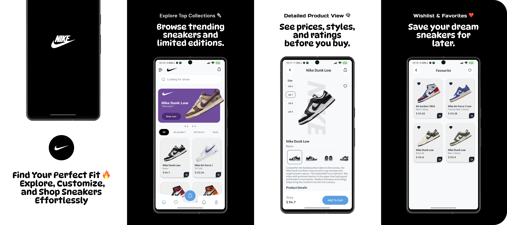
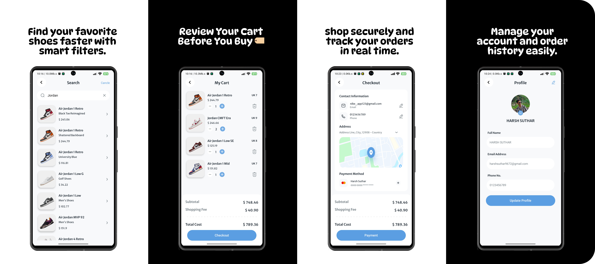

# 👟 𝗡𝗶𝗸𝗲 - 𝗦𝗵𝗼𝗲𝘀𝗔𝗽𝗽 
An Android application for browsing Nike shoes.

## 📖 𝗗𝗲𝘀𝗰𝗿𝗶𝗽𝘁𝗶𝗼𝗻

This Android application allows users to browse a catalog of Nike shoes, add items to a cart 🛒, manage their favorite items ❤️, place orders 📦, and manage their profile 👤. The app integrates with Firebase  🔥 for user authentication, real-time database storage, and image management. The application uses the Cloudinary ☁️ service to upload and manage user profile pictures.

## ✨ 𝗙𝗲𝗮𝘁𝘂𝗿𝗲𝘀 𝗮𝗻𝗱 𝗙𝘂𝗻𝗰𝘁𝗶𝗼𝗻𝗮𝗹𝗶𝘁𝘆

-   🔐 **User Authentication :**
    -   Sign-up and Sign-in with Email/Password using Firebase Authentication.
    -   Google Sign-in integration using Firebase.
    -   Password recovery via email. ✉️
    -   Persistent login using SharedPreferences and Google Sign-in.
      
-   🛍️ **Product Browsing :**
    -   Browse shoes by category (All, Air Jordan 1, Air Force 1, Dunk, Blazer, V2K).
    -   Display of shoe images, names, types, and prices.
    -   Image slider for featured products on the home screen.
      
-   👟 **Product Details :**
    -   Detailed view of each shoe, including multiple images, name, type, price, description, and product details.
    -   Selection of shoe size.
      
-   🛒 **Shopping Cart :**
    -   Add shoes to cart from the product details page.
    -   View and manage items in the cart, including quantity adjustments.
    -   Real-time updates of subtotal, shopping fee, and total cost.
    -   Delete Items from cart.
      
-   💳 **Checkout Process :**
    -   Display subtotal, shipping fee, and total cost.
    -   Address input and storage in Firebase Realtime Database.
    -   Credit card details input and secure storage.
    -   Payment simulation with transaction ID and order ID generation.
    -   Order confirmation notification 🔔.
      
-   ❤️ **Favorite Items :**
    -   Add and remove shoes from a favorites list.
    -   Display of favorite items in a grid layout.
      
-   📦 **Order History :**
    -   Display a list of past orders with order ID, date, time, and total amount.
    -   Detailed view of each order, including product list and shipping address.
      
-   👤 **User Profile :**
    -   View and update profile information, including name, email, and phone number.
    -   Upload and update profile picture using Cloudinary.
      
-   🔎 **Search Functionality :**
    -   Search for shoes by name.
      
-   🧭 **Navigation :**
    -   Bottom navigation for quick access to Home, Favorites, Cart, Notifications, and Profile.
    -   Navigation drawer for accessing Profile, Home, Cart, Favorites, Orders, Notifications, and Sign Out.
      
-   ⚡**Splash Screens :**
    -   Introductory splash screens.
 
## 📸 𝗦𝗰𝗿𝗲𝗲𝗻𝘀𝗵𝗼𝘁𝘀


    
## 🛠️ 𝗧𝗲𝗰𝗵𝗻𝗼𝗹𝗼𝗴𝘆 𝗦𝘁𝗮𝗰𝗸

-   💻 **Kotlin :** Primary programming language.
-   📱 **Android SDK :** For building the Android application.
-   🔥 **Firebase :**
    -   Firebase Authentication: For user authentication.
    -   Firebase Realtime Database: For storing user data, product information, cart details, and order history.
-   ☁️ **Cloudinary :** For image management and storage.
-   🖼️ **Coil (Compose) :** For image loading and caching using AsyncImage.
-   📦 **Jetpack Compose Libraries :**
    -   🎨 Material 3 : For modern Material Design UI components (MaterialTheme, Button, Card, etc.).
    -   📋 LazyColumn / LazyRow : For displaying lists of data (replacement for RecyclerView).
    -   📐 Compose Layouts : Column, Row, Box for flexible UI design (instead of ConstraintLayout).
    -   🌌 Edge-to-Edge UI : Using WindowInsets and SystemUiController for immersive UI experience.
    -   ⚙️ Activity Compose : ComponentActivity with setContent {} to host Compose UI.
-   🛠️ **Gradle :** For dependency management and building the application.

## 📋 𝗣𝗿𝗲𝗿𝗲𝗾𝘂𝗶𝘀𝗶𝘁𝗲𝘀

-   Android Studio 💻 installed on your development machine.
-   A Firebase🔥project with Realtime Database enabled.
-   A Cloudinary ☁️ account for image storage.

## 🚀 𝗜𝗻𝘀𝘁𝗮𝗹𝗹𝗮𝘁𝗶𝗼𝗻 𝗜𝗻𝘀𝘁𝗿𝘂𝗰𝘁𝗶𝗼𝗻𝘀

1.  **Clone the repository :**

    ```bash
    git clone https://github.com/harshstr14/Nike-ShoesApp.git
    ```

2.  **Open the project in Android Studio.**

    *   Launch Android Studio.
    *   Click on "Open an Existing Project".
    *   Navigate to the cloned repository and select the `Nike-ShoesApp` folder.

3.  **Configure Firebase :**

    *   Go to your Firebase project console.
    *   Add a new Android app to your Firebase project.
    *   Download the `google-services.json` file and place it in the `app/` directory of your project.
    *   Ensure that the necessary Firebase dependencies are added to your `build.gradle` files.

        ```gradle
        // Top-level build.gradle
        buildscript {
            dependencies {
                classpath("com.google.gms:google-services:4.4.0")
            }
        }

        // app/build.gradle
        plugins {
            id("com.google.gms.google-services")
        }

        dependencies {
            implementation("com.google.firebase:firebase-auth-ktx:22.3.0")
            implementation("com.google.firebase:firebase-database-ktx:20.3.0")
            // other dependencies
        }
        ```

4.  **Configure Cloudinary :**

    *   Obtain your Cloudinary cloud name, API key, and API secret from your Cloudinary dashboard.
    *   Initialize Cloudinary in the `MyApp.kt` file:

        ```kotlin
        package com.example.nike

        import android.app.Application
        import com.cloudinary.android.MediaManager

        class MyApp: Application() {
            override fun onCreate() {
                super.onCreate()

                val config = HashMap<String, String>()
                config["cloud_name"] = "your_cloud_name" // Replace with your cloud name
                config["api_key"] = "your_api_key" // Replace with your API key
                config["api_secret"] = "your_api_secret" // Replace with your API secret
                MediaManager.init(this,config)
            }
        }
        ```

5.  **Build and run ▶️ the application :**

    *   Connect an Android device or start an emulator.
    *   Click on "Run" in Android Studio to build and run the application on your device/emulator.

## 📖 𝗨𝘀𝗮𝗴𝗲 𝗚𝘂𝗶𝗱𝗲

1.  👋 **Launch the application.**

    *   The app starts with a series of splash screens.

2.  🔐 **Sign-in/Sign-up :**

    *   If you don't have an account, click on the "Sign Up" button to create a new account.
    *   If you already have an account, enter your email and password and click on the "Sign In" button.
    *   You can also use Google Sign-in by clicking on the "Google Sign-in" button.

3.  🛍️ **Browse shoes :**

    *   Once signed in, you'll be taken to the home screen.
    *   Browse shoes by category using the category RecyclerView.
    *   Use the image slider to view featured products.

4.  👟 **View product details :**

    *   Click on a shoe to view its details.
    *   Select your shoe size and click on the "Add to Cart" button to add the shoe to your cart.
    *   Add item to your favourite list

5.  🛒 **Manage cart :**

    *   Click on the cart icon in the bottom navigation bar to view your cart.
    *   Adjust the quantity of items in your cart.
    *   Remove items from your cart.

6.  💳 **Checkout :**

    *   Click on the "Checkout" button to proceed to the checkout page.
    *   Enter your shipping address and credit card details.
    *   Click on the "Payment" button to confirm your order.

7.  📦 **View order history :**

    *   Click on the "Orders" item in the navigation drawer to view your order history.

8.  👤 **Manage profile :**

    *   Click on the "Profile" item in the navigation drawer to view and update your profile information.
    *   Upload a new profile picture by clicking on the camera icon.

9.  🚪 **Sign out :**

    *   Click on the "Sign Out" item in the navigation drawer to sign out of the application.

## 📚 𝗔𝗣𝗜 𝗗𝗼𝗰𝘂𝗺𝗲𝗻𝘁𝗮𝘁𝗶𝗼𝗻

This project uses Firebase🔥Realtime Database. Refer to the official Firebase documentation for API details:

-   [Firebase Realtime Database](https://firebase.google.com/docs/database)

This project uses Cloudinary ☁️ service. Refer to the official Cloudinary documentation for API details:

-   [Cloudinary](https://cloudinary.com/documentation)

## 🤝 𝗖𝗼𝗻𝘁𝗿𝗶𝗯𝘂𝘁𝗶𝗻𝗴 𝗚𝘂𝗶𝗱𝗲𝗹𝗶𝗻𝗲𝘀

Contributions are welcome! To contribute to this project, follow these steps:

1.  Fork the repository 🍴.
2.  Create a new branch for your feature or bug fix 🌱.
3.  Make your changes and commit them with descriptive commit messages 📝.
4.  Test your changes thoroughly ✅.
5.  Submit a pull request to the `master` branch 🔄.

## 📜 𝗟𝗶𝗰𝗲𝗻𝘀𝗲 𝗜𝗻𝗳𝗼𝗿𝗺𝗮𝘁𝗶𝗼𝗻

No license specified. All rights reserved.

## 📬 𝗖𝗼𝗻𝘁𝗮𝗰𝘁/𝗦𝘂𝗽𝗽𝗼𝗿𝘁 𝗜𝗻𝗳𝗼𝗿𝗺𝗮𝘁𝗶𝗼𝗻

For questions or support, please contact: harshstr14@gmail.com
